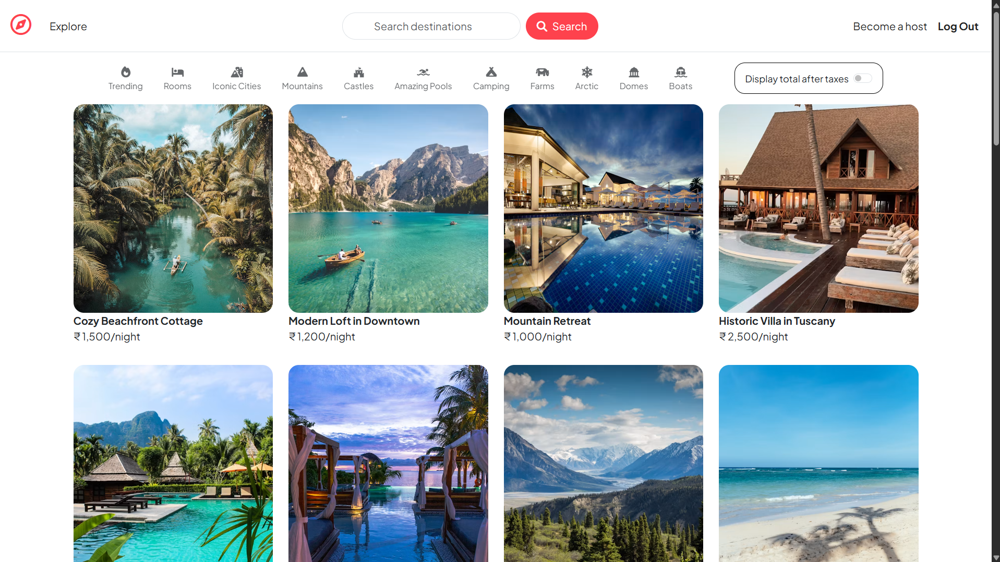
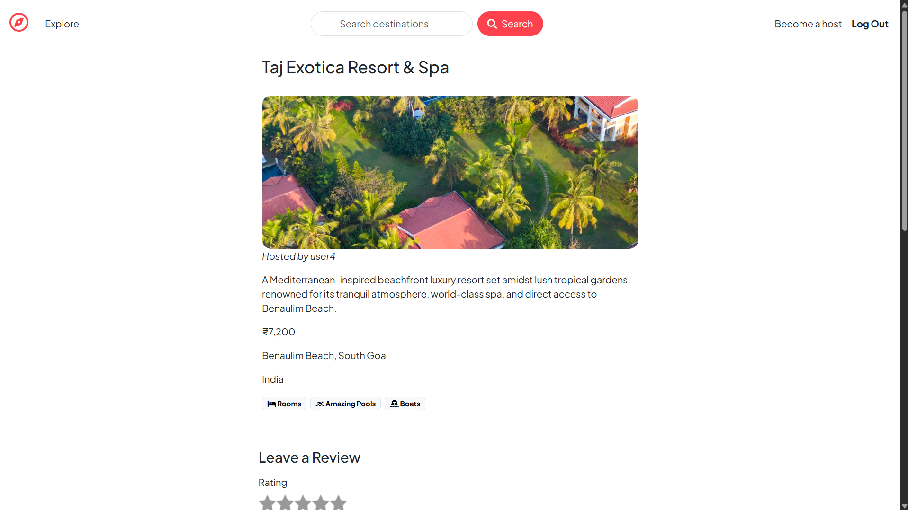
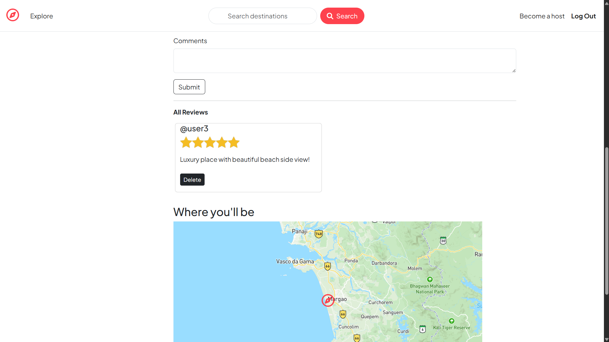
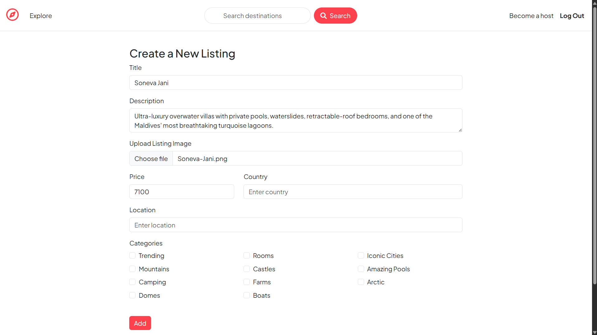
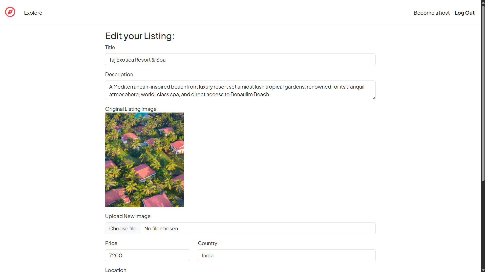
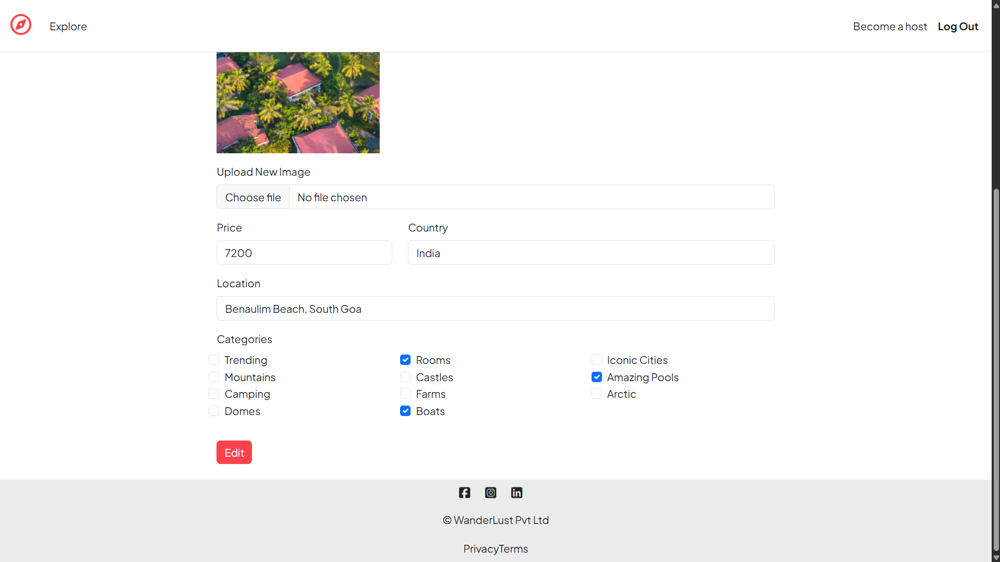
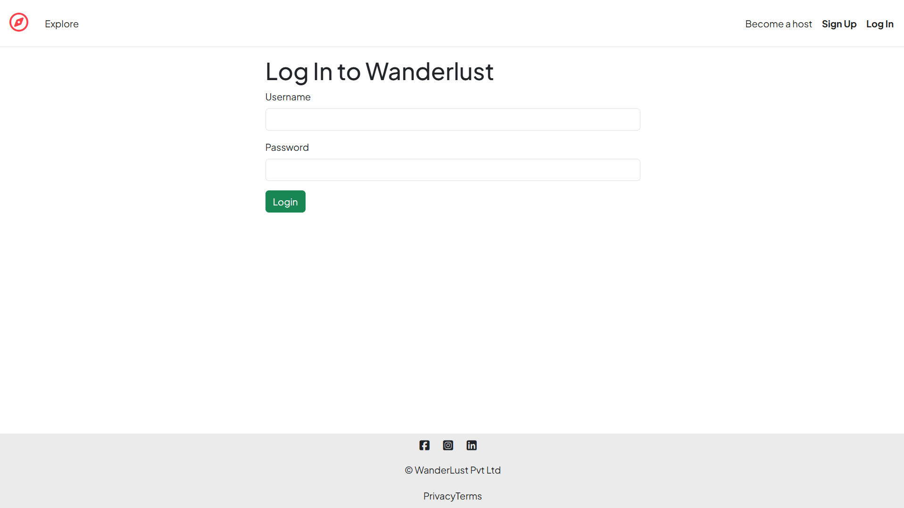
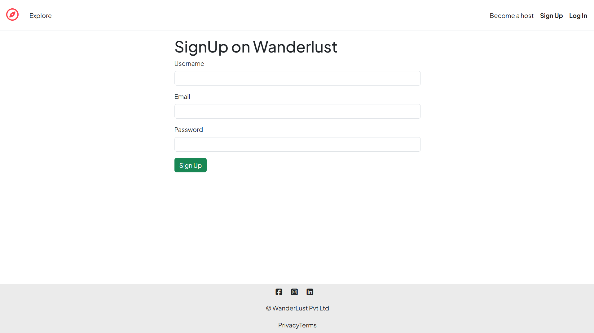

<h1 align="center">Wanderlust</h1>

<p align="center">
A full-stack Airbnb-inspired property listing platform built using Node.js, Express.js, MongoDB, Passport.js, Cloudinary and Mapbox.
</p>

<p align="center">
  
  
  
  
  
  
  
  
</p>

## ⭐ Project Highlights

- Full-stack MVC architecture
- Passport.js authentication
- Cloudinary image upload
- Interactive maps using Mapbox
- Search & category filtering
- Responsive Bootstrap UI

## 🌐 Live Demo

🔗 **Visit the Live Application:** [Wanderlust Live Demo](https://wanderlust-frta.onrender.com/)

---

# Table of Contents

- [🚀 Project Overview](#-project-overview)
- [✨ Features](#-features)
- [🛠 Tech Stack](#-tech-stack)
- [📂 Project Structure](#-project-structure)
- [⚙ Installation](#-installation)
- [🔐 Environment Variables](#-environment-variables)
- [📸 Screenshots](#-screenshots)
- [🔮 Future Improvements](#-future-improvements)
- [🙏 Acknowledgements](#-acknowledgements)
- [👨‍💻 Author](#-author)

---

# 🚀 Project Overview

**Wanderlust** is a full-stack Airbnb-inspired property listing platform
where users can explore destinations, create and manage listings, upload
images, leave reviews, and search listings. Built using the **MVC
(Model--View--Controller)** architecture, the application integrates
**Passport.js** for authentication, **Cloudinary** for image storage,
and **Mapbox** for geocoding and interactive maps. It demonstrates
full-stack web development using **Node.js, Express.js, MongoDB,
Mongoose, EJS, Bootstrap**, and modern web development practices.

---

# ✨ Features

## Authentication

-   User Registration
-   User Login & Logout
-   Session-based Authentication using Passport.js
-   Protected Routes

## Listings

-   Create, Edit and Delete Listings
-   Image Upload using Cloudinary
-   Multiple Categories
-   Interactive Map using Mapbox
-   Responsive Listing Cards

## Reviews

-   Add Reviews
-   Delete Own Reviews
-   Rating System

## Search & Filters

-   Search by Listing Title
-   Search by Location
-   Search by Country
-   Category-based Filtering
-   Combined Search + Category Filter

## Validation & Security

-   Server-side Validation using Joi
-   Authentication & Authorization
-   Flash Messages
-   Method Override
-   Secure Password Hashing

---

# 🛠 Tech Stack

### Frontend

-   HTML5
-   CSS3
-   Bootstrap 5
-   EJS
-   JavaScript (Vanilla)
-   Font Awesome

### Backend

-   Node.js
-   Express.js

### Database

-   MongoDB Atlas
-   Mongoose

### Authentication

-   Passport.js
-   Passport Local

### Services

-   Cloudinary
-   Mapbox

### Validation

-   Joi

---

# 📂 Project Structure

The project follows the **MVC (Model--View--Controller)** architecture.

``` text
app.js

package.json

README.md

assets/
    screenshots/

controllers/
    listings.js
    reviews.js
    users.js

models/
    listing.js
    review.js
    user.js

routes/
    listings.js
    reviews.js
    users.js

views/
    includes/
    layouts/
    listings/
    users/

public/
    css/
    js/

utils/
    categories.js
    expressError.js
    wrapAsync.js

init/
    data.js
    index.js


cloudConfig.js
schema.js
middleware.js
```

---

# ⚙ Installation

``` bash
git clone https://github.com/ManishGoel004/wanderlust.git

cd wanderlust

npm install
```

Create a `.env` file and add the required environment variables.

Run the application:

``` bash
npm start
```

or

``` bash
nodemon app.js
```

---

# 🔐 Environment Variables

``` env
ATLASDB_URL=

SECRET=

MAP_TOKEN=

CLOUD_NAME=

CLOUD_API_KEY=

CLOUD_API_SECRET=
```


---

# 📸 Screenshots

### Home Page



---

### Listing Details





---

### Create Listing



---

### Edit Listing





---

### Login



---

### Signup



---

# 🔮 Future Improvements

-   User Profile Page
-   Hosted Listings Dashboard
-   Wishlist / Favorites
-   Booking System
-   Payment Integration
-   Admin Dashboard
-   Email Notifications

---

# 🙏 Acknowledgements

This project was initially developed as part of the **Sigma 8.0 Full
Stack Web Development** course by **Apna College**. It has been further
extended and customized with additional features, UI improvements, and
enhancements beyond the original course implementation.

---

# 👨‍💻 Author

**Manish Goel**

GitHub: [ManishGoel004](https://github.com/ManishGoel004)

LinkedIn: [manishgoel004](www.linkedin.com/in/manishgoel004)

Live Demo: [https://wanderlust-frta.onrender.com/](https://wanderlust-frta.onrender.com/)
